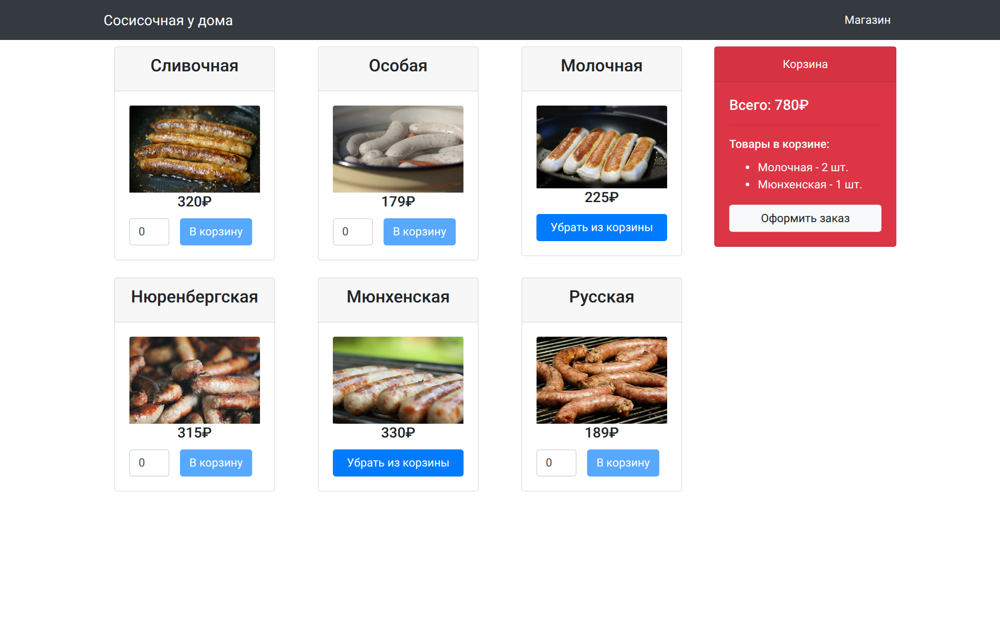
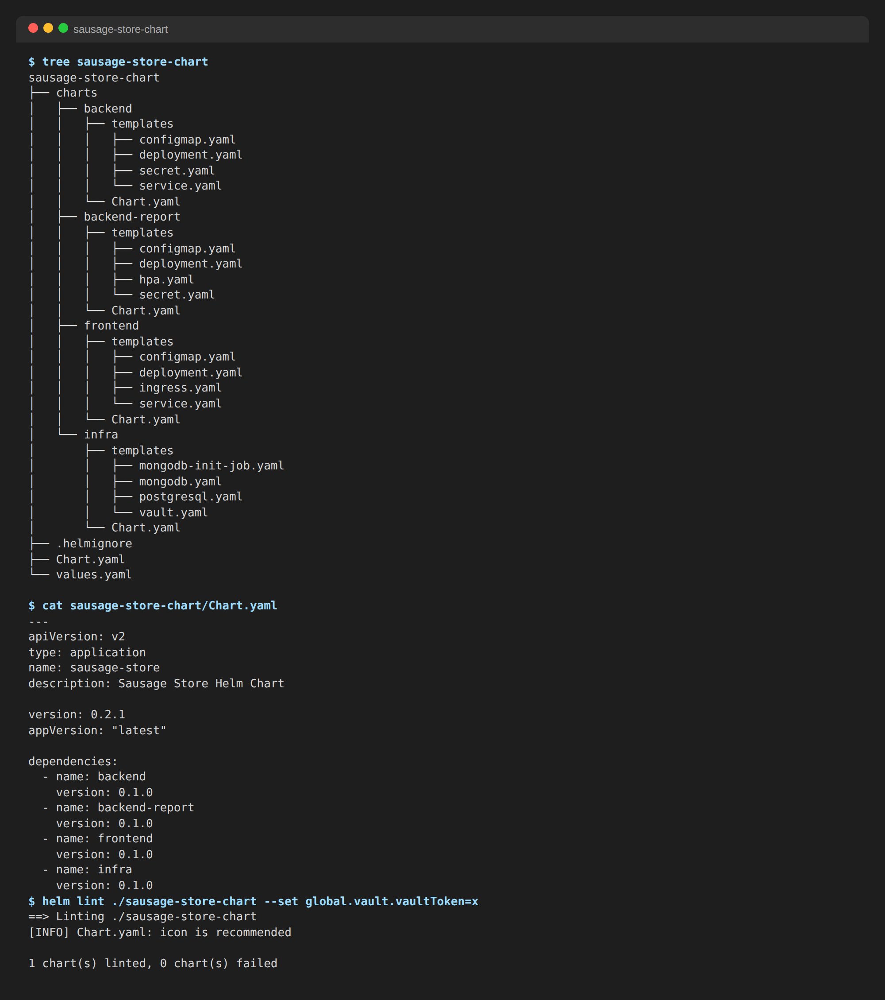
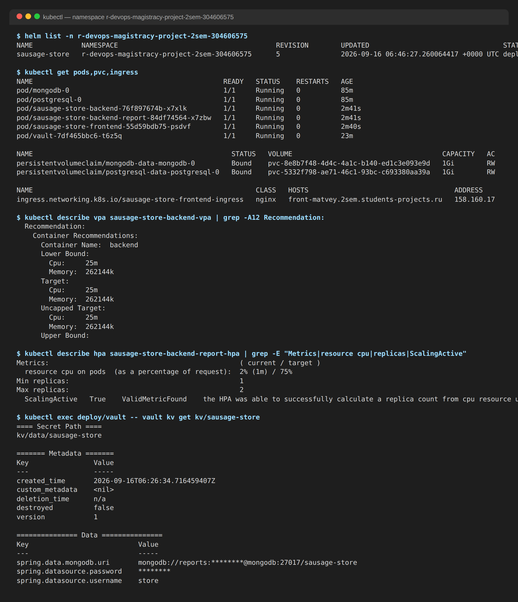
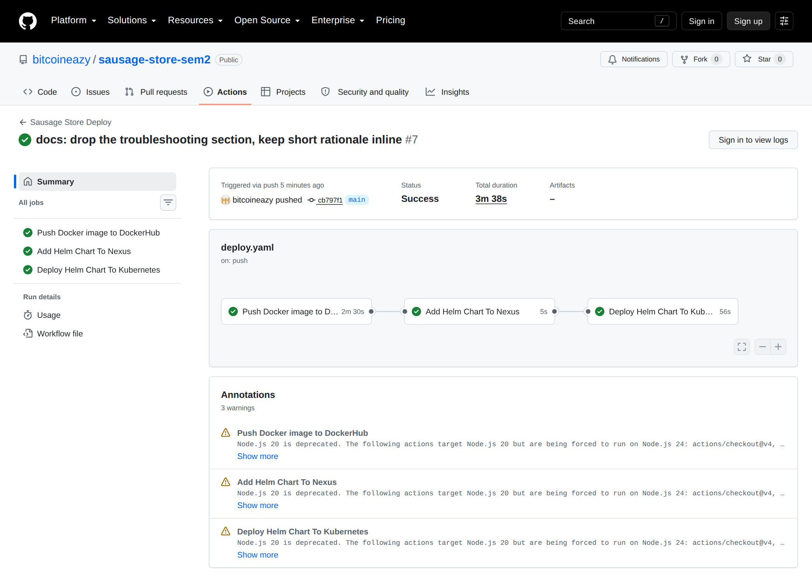
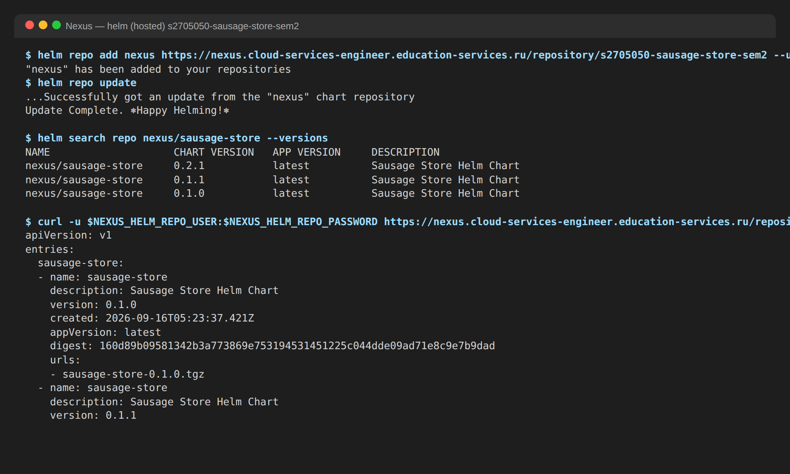

# Sausage Store — финальный проект второго семестра

Интернет-магазин «Сосисочная»: витрина, корзина, оформление заказа и отчёты об активности пользователей.
Проект развёрнут в кластере Kubernetes через Helm-чарт, чарт публикуется в Nexus, сборка и деплой — GitHub Actions.

- Приложение: https://front-matvey.2sem.students-projects.ru
- Образы: `noble6/sausage-backend`, `noble6/sausage-frontend`, `noble6/sausage-backend-report` (Docker Hub)
- Helm-репозиторий: `https://nexus.cloud-services-engineer.education-services.ru/repository/s2705050-sausage-store-sem2` (helm hosted, Allow redeploy)



## Компоненты

| Компонент | Стек | Хранилище | Kubernetes |
|-|-|-|-|
| `frontend` | Angular 6, nginx | — | Deployment (Recreate), Service, Ingress с TLS |
| `backend` | Java 16, Spring Boot 2.6, Flyway | PostgreSQL, MongoDB | Deployment (RollingUpdate), Service, VPA, LivenessProbe |
| `backend-report` | Go | MongoDB | Deployment (Recreate), HPA |
| `infra` | PostgreSQL 15, MongoDB 7, Vault 1.17 | PVC 1 Gi × 2 | StatefulSet × 2, Deployment, Job |

Структура репозитория:

```
.github/workflows/deploy.yaml   # CI/CD: образы → Nexus → helm upgrade
backend/                        # Spring Boot + Flyway-миграции (src/main/resources/db/migration)
backend-report/                 # Go-сервис отчётов
frontend/                       # Angular + multi-stage Dockerfile
sausage-store-chart/            # Зонтичный чарт: Chart.yaml, values.yaml, charts/{frontend,backend,backend-report,infra}
```

## Что сделано

### Dockerfile

- `frontend/Dockerfile` — multi-stage: `node:10-alpine` собирает статику (`ng build --prod`), `nginx:1.25-alpine` её раздаёт. Итоговый образ 75 МБ.
- `backend-report/Dockerfile` — исправлены ошибки шаблона: имя стадии сборки (`builderer` → `builder`) и путь к бинарнику в `CMD`. Образ 61 МБ.
- `backend/Dockerfile` — базовый образ `openjdk:16-jdk-alpine` снят с Docker Hub, заменён на `eclipse-temurin:16-jdk-alpine`; снят жёсткий пин версии `dumb-init`, которого нет в репозитории Alpine.

### Миграции Flyway

Бэкенд запускает Flyway при старте (`spring.flyway.enabled=true`, миграции из `classpath:db/migration`).
Добавлены миграции из проекта DBOps:

| Файл | Назначение |
|-|-|
| `V001__create_tables.sql` | таблицы `product`, `orders`, `order_product` |
| `V002__change_schema.sql` | нормализация: составной первичный ключ, внешние ключи, `NOT NULL`, `CHECK` |
| `V003__insert_data.sql` | 6 продуктов, 10 000 заказов; сдвиг последовательностей после явных `id` |
| `V004__create_index.sql` | индексы для отчётов по `status`, `date_created`, `product_id` |

При первом старте в кластере журнал бэкенда: `Successfully applied 4 migrations to schema "public", now at version v004`.

### Helm-чарт



- Верхнеуровневый `Chart.yaml` с четырьмя зависимостями: `backend`, `backend-report`, `frontend`, `infra`; все параметры вынесены в `values.yaml` (образы, реплики, ресурсы, домен Ingress, строки подключения).
- Шаблоны используют переменные релиза: `{{ .Release.Name }}`, `{{ .Release.Namespace }}`, `{{ .Chart.AppVersion }}`, рекомендованные лейблы `app.kubernetes.io/*`.
- `frontend`: добавлены `Chart.yaml` и `Service`; в Ingress указан хост `front-matvey.2sem.students-projects.ru` и TLS-секрет `2sem-students-projects-wildcard-secret`.
- `backend`: стратегия `RollingUpdate` (`maxSurge: 1`, `maxUnavailable: 0`), `LivenessProbe` на `/actuator/health:8080`, VPA в режиме `Off` (только рекомендации по CPU и памяти).
- `backend-report`: `PORT` в ConfigMap, `DB` (URI MongoDB) в Secret, стратегия `Recreate`, HPA по CPU (1–2 реплики, цель 75 %). Service не создаётся: к сервису отчётов никто не обращается, а квота неймспейса на Service (5) занята остальными компонентами.
- `infra`: PostgreSQL как StatefulSet с `volumeClaimTemplates` (PVC 1 Gi), MongoDB как StatefulSet с PVC 1 Gi и Secret вместо ConfigMap для root-учётки, Job `mongodb-init` (post-install/post-upgrade hook) создаёт пользователя и базу для отчётов (лимит памяти 300 Mi — `mongosh` в 128 Mi не укладывается).
- У всех контейнеров заданы `resources.requests` и `resources.limits`; суммарно ~0,5 CPU / 0,8 Gi запросов при квоте 2 CPU / 1 Gi.

Проверка: `helm lint ./sausage-store-chart` — без ошибок; `helm list` — `STATUS: deployed`; VPA отдаёт рекомендации, HPA считает загрузку CPU, секреты лежат в Vault.



### CI/CD (`.github/workflows/deploy.yaml`)

1. `build_and_push_to_docker_hub` — сборка трёх образов, теги `latest` и SHA коммита.
2. `add_helm_chart_to_nexus` — `helm lint`, `helm package`, загрузка `.tgz` в Nexus (`curl --upload-file` с `NEXUS_HELM_REPO_USER/PASSWORD`).
3. `deploy_helm_chart_to_kubernetes` — `helm repo add nexus $NEXUS_HELM_REPO`, kubeconfig из секрета `KUBE_CONFIG`, `helm upgrade --install sausage-store nexus/sausage-store --version <версия чарта>` с образами по SHA коммита и `--set global.vault.vaultToken=$VAULT_TOKEN`. `--history-max 2`, потому что каждая ревизия Helm — это Secret, а квота неймспейса на Secret — 10.





Прогоны выполняются по одному (`concurrency`), иначе два пуша подряд упираются в `another operation is in progress` у Helm.

Секреты репозитория: `DOCKER_USER`, `DOCKER_PASSWORD`, `NEXUS_HELM_REPO`, `NEXUS_HELM_REPO_USER`, `NEXUS_HELM_REPO_PASSWORD`, `KUBE_CONFIG`, `VAULT_TOKEN`.

## Задание повышенной сложности — Vault

- Vault развёрнут в том же неймспейсе как часть чарта `infra` (`hashicorp/vault:1.17`, dev-режим — сервер стартует уже распечатанным; root-токен берётся из Secret `vault`, который создаётся из `global.vault.vaultToken`). Так весь стек ставится одной командой `helm install`. При старте контейнер включает kv-v2 по пути `kv` и кладёт в `kv/sausage-store` ключи `spring.datasource.username`, `spring.datasource.password`, `spring.data.mongodb.uri` — секреты записываются самим контейнером, а не отдельной Job, потому что бэкенду они нужны уже при первом запуске.
- В `pom.xml` уже была зависимость `spring-cloud-vault-config`; в `application.properties` добавлены `spring.cloud.vault.scheme`, `spring.cloud.vault.host`, `spring.cloud.vault.port`, `spring.cloud.vault.token`, `spring.cloud.vault.kv.enabled` и `spring.config.import=vault://kv/sausage-store`; логин, пароль и URI MongoDB из файла удалены.
- Из Helm-шаблонов бэкенда убран Secret с учётными данными; в контейнер передаются только `SPRING_CLOUD_VAULT_HOST`, `SPRING_CLOUD_VAULT_PORT` и `SPRING_CLOUD_VAULT_TOKEN` (из Secret `vault`). Токен на уровне деплоя: `helm upgrade … --set global.vault.vaultToken=${VAULT_TOKEN}`.
- Проверка: в поде бэкенда нет переменных `SPRING_DATASOURCE_USERNAME/PASSWORD`, приложение стартует, `/actuator/health` → `UP`, витрина отдаёт товары, заказ создаётся.

## Локальный запуск

```bash
# сборка образов
docker build -t sausage-backend --build-arg VERSION=0.1.0 ./backend
docker build -t sausage-frontend ./frontend
docker build -t sausage-backend-report ./backend-report

# установка чарта в свой неймспейс
helm lint ./sausage-store-chart
helm upgrade --install sausage-store ./sausage-store-chart \
  --namespace <namespace> \
  --set global.vault.vaultToken=<любой токен для dev-Vault>
```
